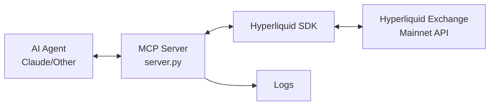

# Hyperliquid MCP Agent - Codebase Overview

## Project Summary

This project is a **Model Context Protocol (MCP) Server** that enables AI agents (like Claude) to interact with the **Hyperliquid** decentralized perpetual futures exchange. It acts as a bridge between AI assistants and the Hyperliquid trading platform, providing comprehensive trading, analytics, and risk management capabilities.

---

## Architecture



The server uses the **FastMCP** framework to expose trading tools via the MCP protocol, communicating either through:
- **Stdio** (Standard I/O) - for local use
- **SSE** (Server-Sent Events) - for remote/VPS deployment

---

## Project Structure

```
hyperliquid-mcp-agent/
├── .env                        # API credentials (private - not in git)
└── deployment-test/
    ├── server.py               # Main MCP server (~1000 lines)
    ├── requirements.txt        # Python dependencies
    ├── pyproject.toml          # Project metadata for uv/pip
    ├── Dockerfile              # Docker container configuration
    ├── verify_tools.py         # Test script for tools
    ├── .env.example            # Template for environment variables
    ├── README.md               # Quick start guide
    ├── walkthrough.md          # Feature documentation
    └── persistent_deployment.md # VPS deployment guide
```

---

## Core Components

### 1. MCP Server (`server.py`)

The main application file containing:

| Component | Description |
|-----------|-------------|
| **AgentLogger** | Logs all tool calls to daily log files (`agent_actions.log`, `trades.log`) |
| **PrecisionManager** | Handles price/size rounding based on exchange metadata |
| **FastMCP Instance** | Core MCP server exposing tools to AI agents |
| **Exchange/Info Clients** | Hyperliquid SDK clients for trading and data retrieval |

### 2. Decorators

- `@log_action` - Automatically logs every tool call
- `@handle_errors` - Catches exceptions and returns user-friendly error messages
- `@ttl_cache(seconds)` - Time-based caching for frequently-called tools

### 3. Configuration

Environment variables (from `.env`):

| Variable | Purpose |
|----------|---------|
| `HL_WL` | Public wallet address (Master Wallet) |
| `HL_PK` | Private key for signing transactions |
| `AG_WL` | Optional Agent Wallet address for verification |
| `ENABLE_MASTER_INTERACTION` | Safety flag to allow direct master wallet usage |

---

## Available Tools

### Market Data

| Tool | Description |
|------|-------------|
| `get_all_mids()` | Current mid prices for all assets |
| `get_l2_snapshot(coin)` | L2 order book snapshot |
| `get_candles(coin, interval, start, end)` | Historical OHLCV data |
| `get_funding_history(coin, start, end)` | Funding rate history |

### Account Information

| Tool | Description |
|------|-------------|
| `get_account_info(type)` | Balances, margin, positions (perp/spot) |
| `get_account_health()` | Equity, margin usage, risk level |
| `get_user_fills()` | Trade history |
| `get_open_orders()` | Current open orders |
| `get_historical_orders()` | Order history |
| `get_user_funding_history(start, end)` | Personal funding payments |

### Trading

| Tool | Description |
|------|-------------|
| `place_order(coin, is_buy, sz, limit_px, ...)` | Basic limit order |
| `place_smart_order(coin, is_buy, size, size_type, ...)` | Smart order with USD/% sizing, TP/SL |
| `cancel_order(coin, oid)` | Cancel single order |
| `close_position(coin, percentage)` | Close position (partial or full) |
| `transfer(amount, destination, token)` | Transfer funds |
| `update_isolated_margin(coin, amount)` | Adjust isolated margin |

### Analytics

| Tool | Description |
|------|-------------|
| `get_token_analytics(coin, interval)` | Technical analysis (RSI, EMA, ADX, etc.) |
| `get_order_book_analytics(coin)` | Order book imbalance, sentiment |
| `get_volume_profile_24h(coin)` | Volume profile (POC, VAH, VAL) |
| `get_correlation_matrix(coins)` | Price correlation between assets |
| `get_market_leaders(limit)` | Top gainers/volume leaders |
| `get_open_interest_delta(coin)` | Open interest analysis |

### Risk Management

| Tool | Description |
|------|-------------|
| `get_position_risk(coin)` | Liquidation price, distance, PnL |
| `get_max_trade_size(coin, leverage)` | Calculate max position size |

### Safety (PANIC Buttons)

| Tool | Description |
|------|-------------|
| `cancel_all_orders()` | Cancel ALL open orders |
| `close_all_positions()` | Market close ALL positions |
| `schedule_cancel(time_ms)` | Dead man's switch |

---

## Dependencies

| Package | Purpose |
|---------|---------|
| `hyperliquid-python-sdk` | Official Hyperliquid API client |
| `mcp` | Model Context Protocol framework |
| `python-dotenv` | Environment variable management |
| `eth-account` | Ethereum wallet/signing operations |

---

## Deployment Options

### Local (Stdio)
```bash
python server.py
```

### Remote VPS (SSE via Docker)
```bash
docker build -t hl-mcp .
docker run -d --restart always --env-file .env -p 127.0.0.1:8000:8000 hl-mcp python server.py --transport sse
```

Connection is secured via SSH tunnel (see `persistent_deployment.md`).

---

## Security Considerations

> [!CAUTION]
> This server has direct access to your trading account via the private key.

1. **Agent Wallet Recommended**: Use an Agent Wallet with limited permissions instead of your Master Wallet
2. **Master Wallet Protection**: `ENABLE_MASTER_INTERACTION=false` by default prevents accidental master wallet usage
3. **SSH Tunnel**: Remote deployments should NEVER expose port 8000 publicly - always use SSH tunneling
4. **Logging**: All actions are logged for audit purposes

---

## Testing

Run the verification script to test read-only tools:
```bash
python verify_tools.py
```

This tests:
- Analytics tools (token analysis, order book, volume profile)
- Account tools (info, health, market leaders)
- Risk tools (position risk, max trade size)

---

## Key Design Decisions

1. **Consolidated Tools**: Multiple related functions merged into single smart tools (e.g., `place_smart_order` handles USD/% sizing)
2. **Precision Handling**: `PrecisionManager` automatically applies correct decimals for each asset
3. **TTL Caching**: Frequently-called tools cache results to reduce API load
4. **Dual Transport**: Supports both Stdio (local) and SSE (remote) transports
5. **Comprehensive Logging**: Every tool call logged with timestamps for debugging and audit

---

## Summary

This MCP server transforms Hyperliquid into a "Trading OS" for AI agents, providing:
- ✅ Real-time market data access
- ✅ Smart order placement with flexible sizing
- ✅ Risk monitoring and management
- ✅ Panic buttons for emergency exits
- ✅ Secure remote deployment options
- ✅ Comprehensive action logging
