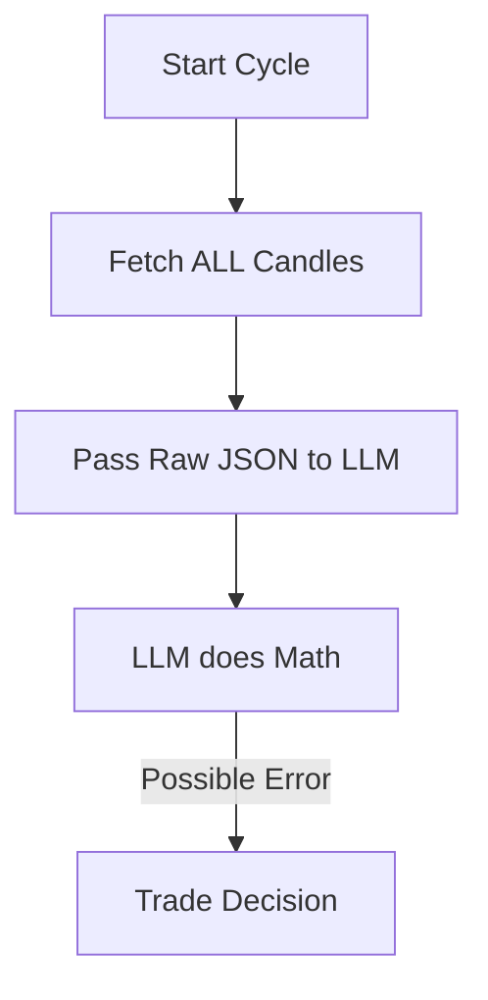
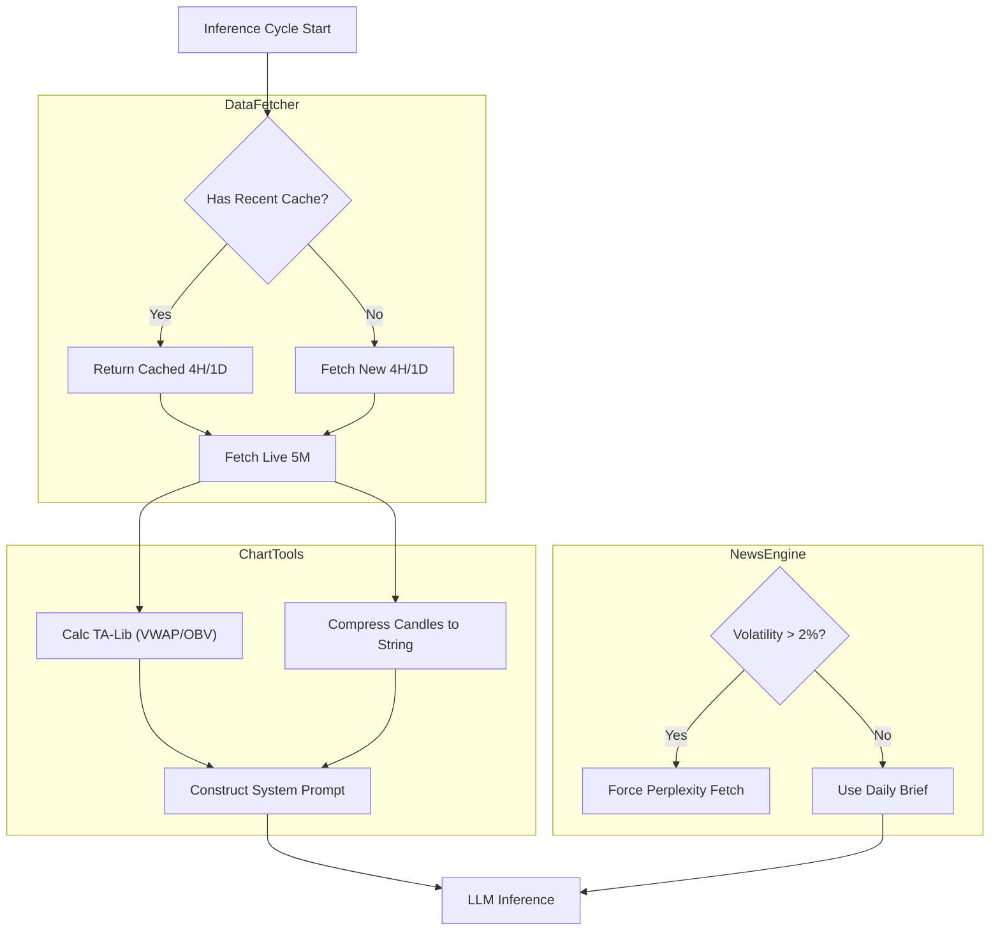

# Context Optimization Master Plan

**Objective:** Upgrade the Agent's perception layer to reduce costs, eliminate hallucinations, and improve safety.

## 0. Workflow Options (Visualized)

_Response to: "Bring back the workflows so we can choose."_

### Option A: The Current "Blind" Workflow (Legacy)

_Status: Latency High, Hallucination Risk High, Cost High._



### Option B: The "Optimized" Workflow (Recommended)

_Status: Latency Low, Zero Hallucination, Cost -60%._



---

## 1. "Regime-Aware" Pattern Engine

**New Logic:**

- **Tagging:** History is bucketed by `AdxStrength` (Trend vs Range).
- **Injection:** "Current Regime: [RANGING]. In ranging markets, your Mean Reversion strategy has 82% WR."
- **Benefit:** Removes directional bias.

---

## 2. Implementation Specifications

### Phase 1: Smart Caching (Cost Reduction)

**File:** `agent/services/data_fetcher.py`
**Goal:** Reduce API calls by ~60%.

**Logic:**

- **Singleton Cache:** `_MARKET_CACHE = {}`
- **TTL Rules:**
  - `1m` / `5m` Candles: **0s (Never Cache)**.
  - `1h` Candles: **5 min**.
  - `4h` / `1d` Candles: **15 min**.
- **Safety Valve:** If Price moves >1% in 1 minute, **Invalidate All Caches**.

### Phase 2: Zero-Hallucination Context (Robust Suite)

**File:** `agent/nodes/analyst_v2.py`
**Goal:** Institutional Indicators via TA-Lib.

**The Strategy:**

1.  **Intraday (5M/15M):** `Bollinger(10, 1.5)` + `VWAP`. (Captures quick squeezes).
2.  **Swing (1H/4H):** `Bollinger(20, 2.0)` + `OBV`. (Standard Trend).

**Prompt Injection:**

```text
[BTC 5M]
Price: $98,240 (Above VWAP)
Bands: Squeeze (Width < 0.5%) | Upper: $98,300
Vol: High (ATR=50) | Flow: Accumulation (OBV Rising)
```

### Phase 3: Hybrid Safety ("Smart Limit Chase")

**File:** `agent/nodes/risk_v2.py`
**Goal:** Better fills than Market Orders.

**Logic:**

1.  **Entry:** Agent places **Limit Order** at `Ask + 0.05%` (Aggressive Limit).
    - _Why?_ Acts like a Market order but prevents 5% slippage wicks.
2.  **Hard Floor:** Agent _immediately_ sends `STOP_MARKET` order to Exchange (ReduceOnly).
3.  **Soft Ceiling:** If Profit > 1R, Agent _modifies_ SL to Break-Even.

### Phase 4: Foundational Context (Perplexity)

**File:** `agent/services/news_fetcher.py`

**Prerequisites (User Action Required):**

- [ ] Get Perplexity API Key (`pplx-...`).
- [ ] Add `PERPLEXITY_API_KEY` to `.env`.

**Logic:**

- **Daily Brief:** At 08:00 Local, fetch "Top 3 Crypto Drivers".
- **Panic Trigger:** If Price moves >2% in 5m, fetch "Why is crypto dumping?".

---

## 3. Execution Roadmap

- [ ] **Step 1 (Caching):** Implement TTL Cache in `data_fetcher.py`.
- [ ] **Step 2 (Math):** Create `chart_tools.py` with TA-Lib integration.
- [ ] **Step 3 (Prompt):** Update `analyst_v2.py` to ingest the new "Robust Suite".
- [ ] **Step 4 (News):** Stub out `news_fetcher.py` (Wait for API Key).
